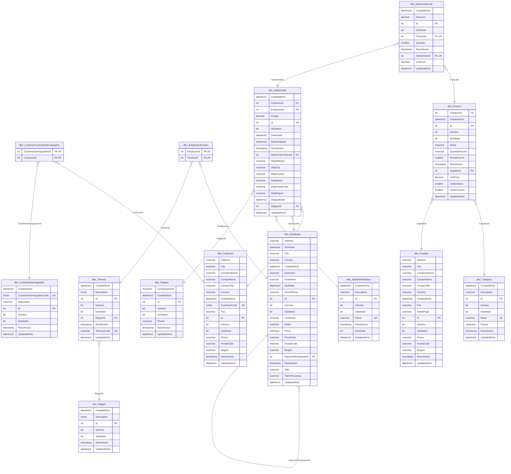

# Southbreeze
This project contains a modified version of the Microsoft Northwind sample database.

The original Northwind database was created by Microsoft and has been substantially modified for instructional use, including:
- Renamed tables and columns
- New primary key strategy
- New lookup tables
- Additional auditing fields
- Additional constraints
- New example queries

See Microsoft's original Northwind sample database for historical reference.

## Setup
In the scripts folder, **look for the subfolder for your particular DBMS**.
Get the _southbreeze_database.sql_ script
 - This script will create the tables and seed initial data in the table
Execute this script on an empty database 

## Usage
In the scripts folder, again **look for the subfolder for your particular DBMS**.
Get the _example_queries.sql_ script and open it in a text editor/viewer such as Notepad++ if you are on Windows
Read through the file, the comments describe what each query does.
 - **Note**: None of them modify the data in the database, so you can run them as many times as you want
These example ad-hoc queries demonstrate relational database operations such as:
     - Cartesian product
     - Integrity constraints
     - Project
         - This is really just selecting columns by name to get a logical view of the data independent of the physical view
     - Several examples of queries that would answer common business questions, including:
         - Which products are currently active and not deleted
         - Which orders have not shipped yet
         - Which customers are located in Germany
     - Join operations, including:
         - Inner/equi join (following a foreign key)
         - Theta join (joining data using a comparison other than equals)
         - Left/Right outer join
         - Full outer join
         - Left/Right semi-join
         - Natural join
     - Relational Division
     - Arithmetic operations
         - Counting the number of records
     - Nested operations
     - Grouping of results
     - Sorting of results
     - Set operations
         - Union - Combines results and removes duplicates
         - Union All - Combines results and keeps duplicates
         - Intersect - only values that appear in both result sets
         - Except - difference operations
     -  Views
         -  Creating
         -  Querying
     -  Recursive querying of a table for:
         -  Direct relationships
         -  Full hierarchical demonstration

## Southbreeze design
 - Mermaid ERD diagram created with mermerd

