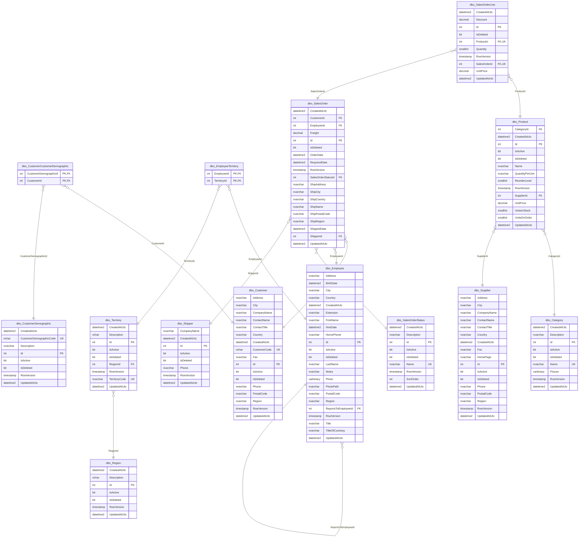

# Southbreeze
An example database based on the original Northwind database but refactored with best/better practices and naming conventions

MermaidJS diagram created with mermerd

```mermaid
erDiagram
    dbo_Category {
        datetime2 CreatedAtUtc 
        nvarchar Description 
        int Id PK 
        bit IsActive 
        bit IsDeleted 
        nvarchar Name UK 
        varbinary Picture 
        timestamp RowVersion 
        datetime2 UpdatedAtUtc 
    }

    dbo_Customer {
        nvarchar Address 
        nvarchar City 
        nvarchar CompanyName 
        nvarchar ContactName 
        nvarchar ContactTitle 
        nvarchar Country 
        datetime2 CreatedAtUtc 
        nchar CustomerCode UK 
        nvarchar Fax 
        int Id PK 
        bit IsActive 
        bit IsDeleted 
        nvarchar Phone 
        nvarchar PostalCode 
        nvarchar Region 
        timestamp RowVersion 
        datetime2 UpdatedAtUtc 
    }

    dbo_CustomerCustomerDemographic {
        int CustomerDemographicId PK,FK 
        int CustomerId PK,FK 
    }

    dbo_CustomerDemographic {
        datetime2 CreatedAtUtc 
        nchar CustomerDemographicCode UK 
        nvarchar Description 
        int Id PK 
        bit IsActive 
        bit IsDeleted 
        timestamp RowVersion 
        datetime2 UpdatedAtUtc 
    }

    dbo_Employee {
        nvarchar Address 
        datetime2 BirthDate 
        nvarchar City 
        nvarchar Country 
        datetime2 CreatedAtUtc 
        nvarchar Extension 
        nvarchar FirstName 
        datetime2 HireDate 
        nvarchar HomePhone 
        int Id PK 
        bit IsActive 
        bit IsDeleted 
        nvarchar LastName 
        nvarchar Notes 
        varbinary Photo 
        nvarchar PhotoPath 
        nvarchar PostalCode 
        nvarchar Region 
        int ReportsToEmployeeId FK 
        timestamp RowVersion 
        nvarchar Title 
        nvarchar TitleOfCourtesy 
        datetime2 UpdatedAtUtc 
    }

    dbo_EmployeeTerritory {
        int EmployeeId PK,FK 
        int TerritoryId PK,FK 
    }

    dbo_Product {
        int CategoryId FK 
        datetime2 CreatedAtUtc 
        int Id PK 
        bit IsActive 
        bit IsDeleted 
        nvarchar Name 
        nvarchar QuantityPerUnit 
        smallint ReorderLevel 
        timestamp RowVersion 
        int SupplierId FK 
        decimal UnitPrice 
        smallint UnitsInStock 
        smallint UnitsOnOrder 
        datetime2 UpdatedAtUtc 
    }

    dbo_Region {
        datetime2 CreatedAtUtc 
        nchar Description 
        int Id PK 
        bit IsActive 
        bit IsDeleted 
        timestamp RowVersion 
        datetime2 UpdatedAtUtc 
    }

    dbo_SalesOrder {
        datetime2 CreatedAtUtc 
        int CustomerId FK 
        int EmployeeId FK 
        decimal Freight 
        int Id PK 
        bit IsDeleted 
        datetime2 OrderDate 
        datetime2 RequiredDate 
        timestamp RowVersion 
        int SalesOrderStatusId FK 
        nvarchar ShipAddress 
        nvarchar ShipCity 
        nvarchar ShipCountry 
        nvarchar ShipName 
        nvarchar ShipPostalCode 
        nvarchar ShipRegion 
        datetime2 ShippedDate 
        int ShipperId FK 
        datetime2 UpdatedAtUtc 
    }

    dbo_SalesOrderLine {
        datetime2 CreatedAtUtc 
        decimal Discount 
        int Id PK 
        bit IsDeleted 
        int ProductId FK,UK 
        smallint Quantity 
        timestamp RowVersion 
        int SalesOrderId FK,UK 
        decimal UnitPrice 
        datetime2 UpdatedAtUtc 
    }

    dbo_SalesOrderStatus {
        datetime2 CreatedAtUtc 
        nvarchar Description 
        int Id PK 
        bit IsActive 
        bit IsDeleted 
        nvarchar Name UK 
        timestamp RowVersion 
        int SortOrder 
        datetime2 UpdatedAtUtc 
    }

    dbo_Shipper {
        nvarchar CompanyName 
        datetime2 CreatedAtUtc 
        int Id PK 
        bit IsActive 
        bit IsDeleted 
        nvarchar Phone 
        timestamp RowVersion 
        datetime2 UpdatedAtUtc 
    }

    dbo_Supplier {
        nvarchar Address 
        nvarchar City 
        nvarchar CompanyName 
        nvarchar ContactName 
        nvarchar ContactTitle 
        nvarchar Country 
        datetime2 CreatedAtUtc 
        nvarchar Fax 
        nvarchar HomePage 
        int Id PK 
        bit IsActive 
        bit IsDeleted 
        nvarchar Phone 
        nvarchar PostalCode 
        nvarchar Region 
        timestamp RowVersion 
        datetime2 UpdatedAtUtc 
    }

    dbo_Territory {
        datetime2 CreatedAtUtc 
        nchar Description 
        int Id PK 
        bit IsActive 
        bit IsDeleted 
        int RegionId FK 
        timestamp RowVersion 
        nvarchar TerritoryCode UK 
        datetime2 UpdatedAtUtc 
    }

    dbo_Product }o--|| dbo_Category : "CategoryId"
    dbo_CustomerCustomerDemographic }o--|| dbo_Customer : "CustomerId"
    dbo_SalesOrder }o--|| dbo_Customer : "CustomerId"
    dbo_CustomerCustomerDemographic }o--|| dbo_CustomerDemographic : "CustomerDemographicId"
    dbo_Employee }o--|| dbo_Employee : "ReportsToEmployeeId"
    dbo_EmployeeTerritory }o--|| dbo_Employee : "EmployeeId"
    dbo_SalesOrder }o--|| dbo_Employee : "EmployeeId"
    dbo_EmployeeTerritory }o--|| dbo_Territory : "TerritoryId"
    dbo_Product }o--|| dbo_Supplier : "SupplierId"
    dbo_SalesOrderLine }o--|| dbo_Product : "ProductId"
    dbo_Territory }o--|| dbo_Region : "RegionId"
    dbo_SalesOrder }o--|| dbo_SalesOrderStatus : "SalesOrderStatusId"
    dbo_SalesOrder }o--|| dbo_Shipper : "ShipperId"
    dbo_SalesOrderLine }o--|| dbo_SalesOrder : "SalesOrderId"
```
